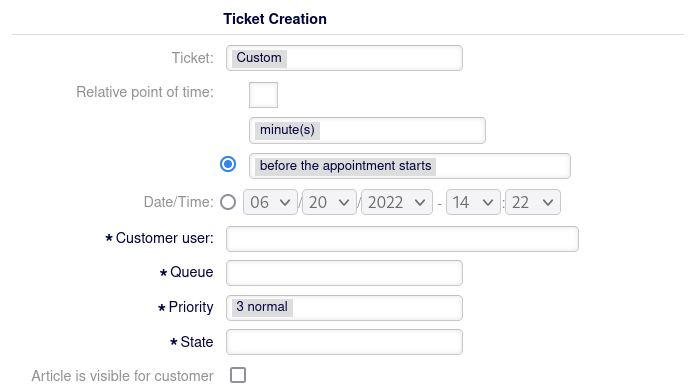

.. image:: ../images/otobo-logo.png
   :align: center
|

.. toctree::
    :maxdepth: 2
    :caption: Contents

Sacrifice to Sphinx
===================

Description
===========
This package brings the functionality to automatically create a ticket with configurable parameters to a freely chooseable point in time in relation to an appointment.

Ticket Creation is initiated in the AppointmentEdit mask under the section 'Ticket Creation'. A point in time relative to the appointment, as well as ticket data can be configured. Recurring appointments are supported.

The feature as of now does not support dynamic fields of type database.

   The screenshot shows the newly available fields for ticket creation.

System requirements
===================

Framework
---------
OTOBO 11.0.x

Packages
--------
\-

Third-party software
--------------------
\-

Configuration Reference
=======================

Frontend::Agent::ModuleRegistration::Loader
------------------------------------------------------------------------------------------------------------------------------

Loader::Module::AgentAppointmentCalendarOverview###009-AppointmentTicket
^^^^^^^^^^^^^^^^^^^^^^^^^^^^^^^^^^^^^^^^^^^^^^^^^^^^^^^^^^^^^^^^^^^^^^^^^^^^^^^^^^^^^^^^^^^^^^^^^^^^^^^^^^^^^^^^^^^^^^^^^^^^^^
Loadermodule registration for the agent interface.

Frontend::Agent::View::AgentAppointmentEdit
------------------------------------------------------------------------------------------------------------------------------

Ticket::Frontend::AgentAppointmentEdit###ServiceMandatory
^^^^^^^^^^^^^^^^^^^^^^^^^^^^^^^^^^^^^^^^^^^^^^^^^^^^^^^^^^^^^^^^^^^^^^^^^^^^^^^^^^^^^^^^^^^^^^^^^^^^^^^^^^^^^^^^^^^^^^^^^^^^^^
Sets if service must be selected by the agent.

Ticket::Frontend::AgentAppointmentEdit###DynamicField
^^^^^^^^^^^^^^^^^^^^^^^^^^^^^^^^^^^^^^^^^^^^^^^^^^^^^^^^^^^^^^^^^^^^^^^^^^^^^^^^^^^^^^^^^^^^^^^^^^^^^^^^^^^^^^^^^^^^^^^^^^^^^^
Dynamic fields shown in the appointment edit screen of the agent interface

Ticket::Frontend::AgentAppointmentEdit###StateDefault
^^^^^^^^^^^^^^^^^^^^^^^^^^^^^^^^^^^^^^^^^^^^^^^^^^^^^^^^^^^^^^^^^^^^^^^^^^^^^^^^^^^^^^^^^^^^^^^^^^^^^^^^^^^^^^^^^^^^^^^^^^^^^^
Sets the default next state for new tickets in the AgentAppointmentEdit interface.

Ticket::Frontend::AgentAppointmentEdit###SLAMandatory
^^^^^^^^^^^^^^^^^^^^^^^^^^^^^^^^^^^^^^^^^^^^^^^^^^^^^^^^^^^^^^^^^^^^^^^^^^^^^^^^^^^^^^^^^^^^^^^^^^^^^^^^^^^^^^^^^^^^^^^^^^^^^^
Sets if SLA must be selected by the agent.

Ticket::Frontend::AgentAppointmentEdit###Priority
^^^^^^^^^^^^^^^^^^^^^^^^^^^^^^^^^^^^^^^^^^^^^^^^^^^^^^^^^^^^^^^^^^^^^^^^^^^^^^^^^^^^^^^^^^^^^^^^^^^^^^^^^^^^^^^^^^^^^^^^^^^^^^
Sets the default priority for new tickets in the AgentAppointmentEdit interface.

Frontend::Agent::View::TicketCalendar
------------------------------------------------------------------------------------------------------------------------------

Ticket::Frontend::AgentAppointmentEdit###StateType
^^^^^^^^^^^^^^^^^^^^^^^^^^^^^^^^^^^^^^^^^^^^^^^^^^^^^^^^^^^^^^^^^^^^^^^^^^^^^^^^^^^^^^^^^^^^^^^^^^^^^^^^^^^^^^^^^^^^^^^^^^^^^^
Determines the next possible ticket states, after the creation of a new ticket from a calendar appointment in the agent interface.

Frontend::Base::DynamicFieldScreens
------------------------------------------------------------------------------------------------------------------------------

DynamicFieldScreens###AppointmentTickets
^^^^^^^^^^^^^^^^^^^^^^^^^^^^^^^^^^^^^^^^^^^^^^^^^^^^^^^^^^^^^^^^^^^^^^^^^^^^^^^^^^^^^^^^^^^^^^^^^^^^^^^^^^^^^^^^^^^^^^^^^^^^^^
This configuration defines all possible screens to enable or disable dynamic fields.

About
=======

Contact
-------
| Rother OSS GmbH
| Email: hello@otobo.de
| Web: https://otobo.de

Version
-------
Author: |doc-vendor| / Version: |doc-version| / Date of release: |doc-datestamp|
